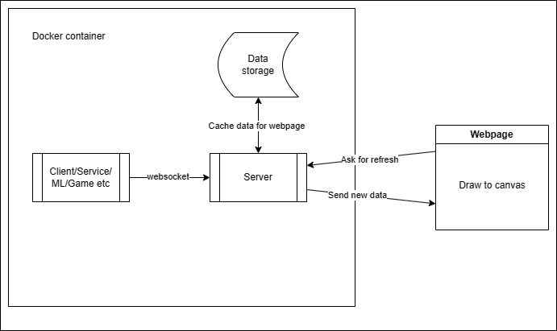
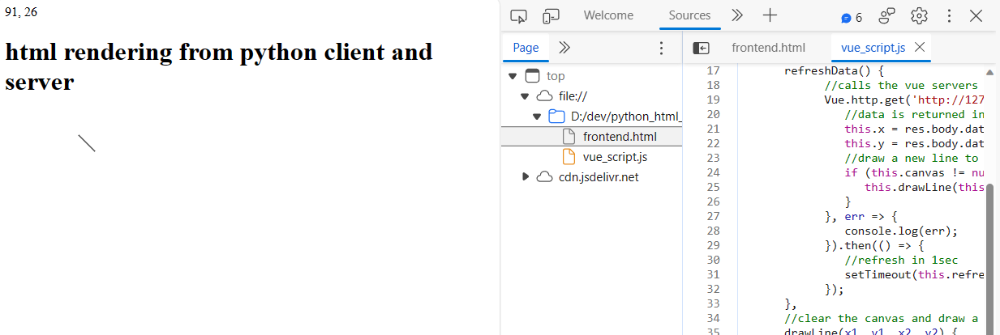

# HTML canvas rendering python client data #

This is a simple but complicated way of rendering 2D data from a python script running in docker. It using Vue and Flask to create a webserver then websockets between the client and server for data transfer.



### To Run ###

* Run docker build ```docker build -t python_web .```
* Start the container ```docker run -it --rm -p 7777:7777 -v <this_dir>:/myvol python_web```
* Enter ```/myvol```
* Run ```python3 server.py```
* From a new terminal run ```python3 generator.py```. This script only runs for a fixed amount of time so you'll need to restart it if needed. 
* Now the server and generator are running in docker we can open ```frontend.html``` from the host machine and see the output.

### Result ###

The demo is rather simple in what it displays but you'll see the data received in the top left hand corner and a line that moves around the screen once per second. The idea is that this technique can then be extended to display realtime data from a python task or perhaps game rendering.  


